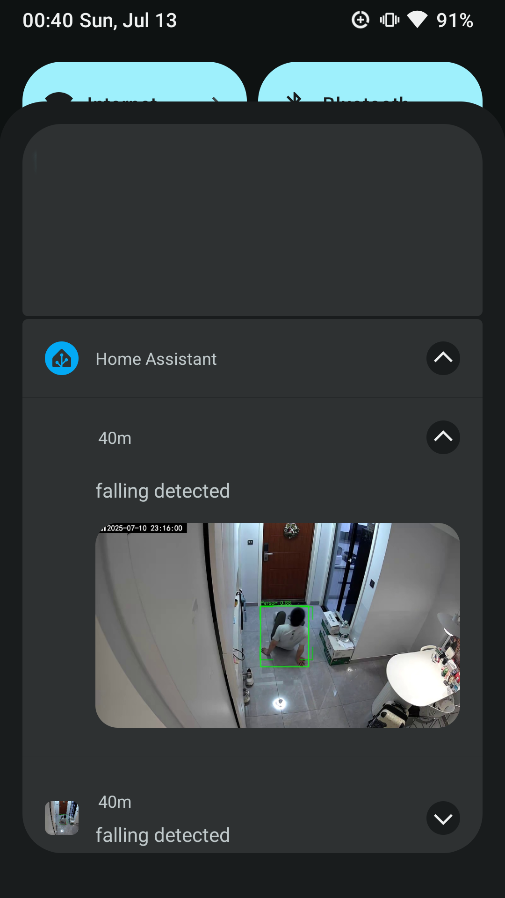

# Summary
A simple project that sends phone notifications when a person falls. Image recognition is handled by an LLM (Google Gemini), with YOLOv8 used to detect motion and reduce token usage. Notifications are triggered via an MQTT topic in Home Assistant.  

# Configuration
## Gemini Api
Apply for a Gemini API  
Proxy in USA or other allowed location  

## Home Assistant
1. install addons/intergrations: MQTT, File editor  
1. install home assistant app on your phone  
1. create a mqtt image entity to store the image:  
    configuration.yaml  
    ```yaml
    mqtt:
    - image:
        image_topic: "nvr/notification/image"
        content_type: "image/jpeg"

    ```
1. add a automation to send notification with image to your phone when received trigger topic:  
    note: I used a different topic to trigger the notification  
    automations.yaml  
    ```yaml
    - id: '1752309664786'
    alias: falling_notifiction
    description: ''
    triggers:
    - trigger: mqtt
        topic: nvr/notification/trigger
    conditions: []
    actions:
    - action: notify.mobile_app_mi6
        metadata: {}
        data:
        data:
            image: /api/image_proxy/image.mqtt_image
        message: falling detected
    mode: single
    ```
## PC
1. test the automation:  
    install mosquitto on ubuntu, and publish to topics  
    ```bash
    mosquitto_pub -h hass_ip -u hass_user -P hass_password -t nvr/notification/image -f test/fall.jpg
    mosquitto_pub -h hass_ip -u hass_user -P hass_password -t nvr/notification/trigger -m "yes"
    ```
    You should now receive a notification on your phone, including a message with a thumbnail image. On Android, you can tap the expand icon to view the full image. However, this feature is not supported on iOS.
      
1. create a test rtsp stream  
    the live.mp4 is 5 fps, can't be read directly, if your test.mp4 has a normal fps, this step is not needed.  
    use mediamtx start a test rtsp server at port 9554  
    use ffmpeg to push live.mp4 to rtsp stream in loop  
    ```bash
    ffmpeg -stream_loop -1 -re -i test/live.mp4 -c copy -f rtsp rtsp://localhost:9554/live
    ```

## Program
1. this is a uv project, install uv and run  
    ```bash
    # comment out cvShowImage in non gui environment or vscode terminal
    uv sync 
    source .venv/bin/activate
    cp .env.example .env
    vi .env 
    python main.py 
    ```
